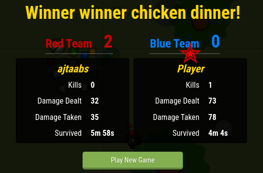
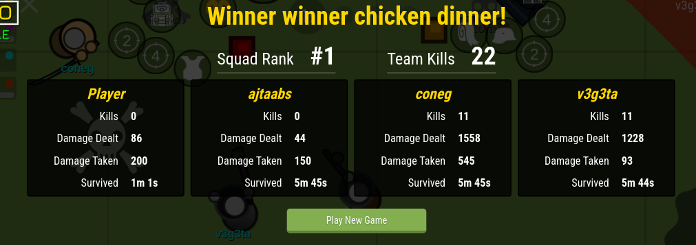

# surviv-links
a collection of links of alternatives for the game surviv.io

 <a href="https://survev.io" target="_blank">survev.io</a> - most used alternative for the game 

<a href="https://expandedwater.online" target="_blank">expandedwater.online</a> - what seems to be a hosted custom server of survev, usually changes between modes from time to time. As of writing this, the server is on 50 v 50 mode

<a href="https://suroi.io" target="_blank">suroi.io</a> - An open source game similar to surviv, made by the creators of ReSurviv.

<a href="https://resurviv.biz" target="_blank">resurviv.biz</a> - A hosted server of resurviv, modified so that the player has overpowered weapons.

 <a href="https://c79geyxwmp1zpas3qxbddzrtytffta.ext-twitch.tv/c79geyxwmp1zpas3qxbddzrtytffta/1.0.2/ce940530af57d2615ac39c266fe9679d/index_twitch.html" target="_blank">Twitch Mirror</a> - An old mirror of the game hosted on some twitch cdn it seems, no longer functional as the original game servers for surviv have been shutdown.

 <a href="https://www.twitch.tv/popout/survivio/extensions/c79geyxwmp1zpas3qxbddzrtytffta/panel" target="_blank">Twitch Surviv Panel</a> - The original link for that twitch mirror, supposedly a custom server of the original surviv where streamers would team and 4v4 or 1v1 each other

http://surviv.wf/ - some random modded server i found on discord, named "shrek.io" as a joke i assume

http://66.179.254.36/ - found this in the discord server for survev, known as the "66 link" in the server to 1v1 people or something i guess

https://leia-uwu.github.io/survev/ - offline survev client that has old maps and modes

## other links and resources

https://github.com/leia-uwu/survev - repository of survev, development on this repo isnt continued

https://github.com/NAMERIO/resurviv - source repo of resurviv.biz

https://gitlab.com/hasanger/survivreloaded - old gitlab of resurviv/surviv reloaded

## suroi mirrors

https://suroi.io - official site

http://camvan.xyz/

http://124.223.18.68/ - modded server (shanghai)

http://hk.camvan.xyz/

source code for the modded server - https://github.com/XNORIGC/suroi.cn

